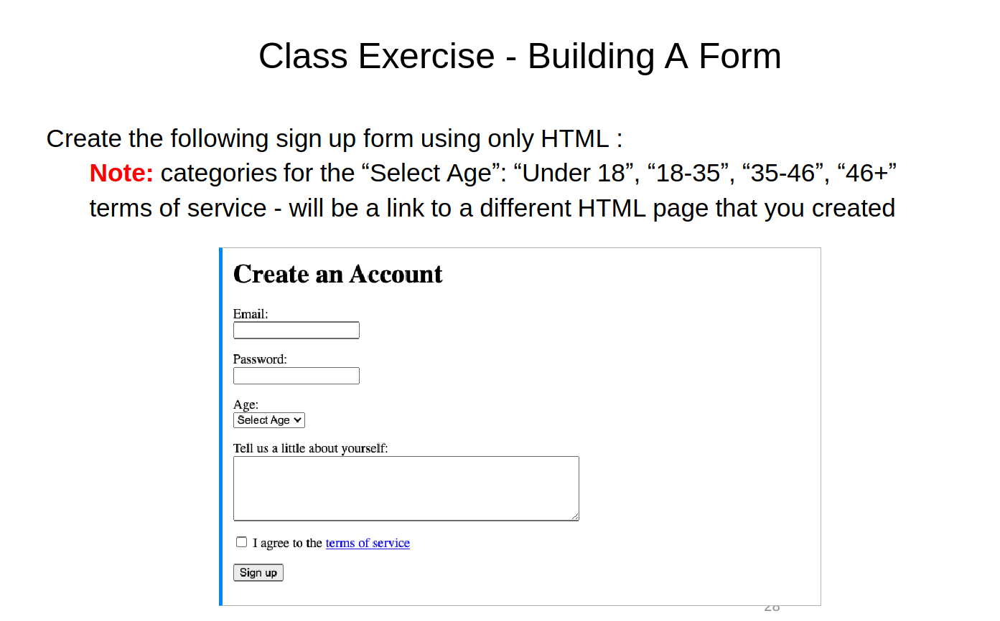
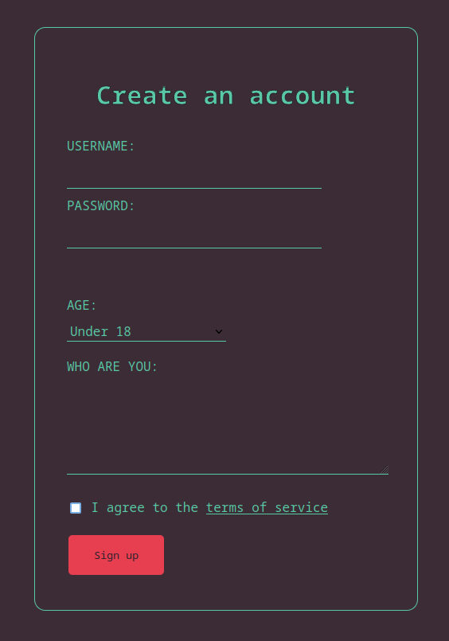
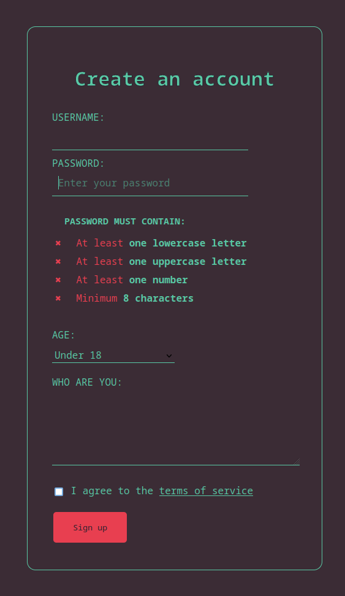

> **3d lesson homework:**
> [The lesson material](./src/02%20subject%20html%20basic.pdf)
> Page 6 - done during the class work [See here](../Classwork/index.html)
> Page 28 - done at home page [See here](../Homework/index.html)
> 

# The homework was to make the account creation form:

### Required :

### Result:

